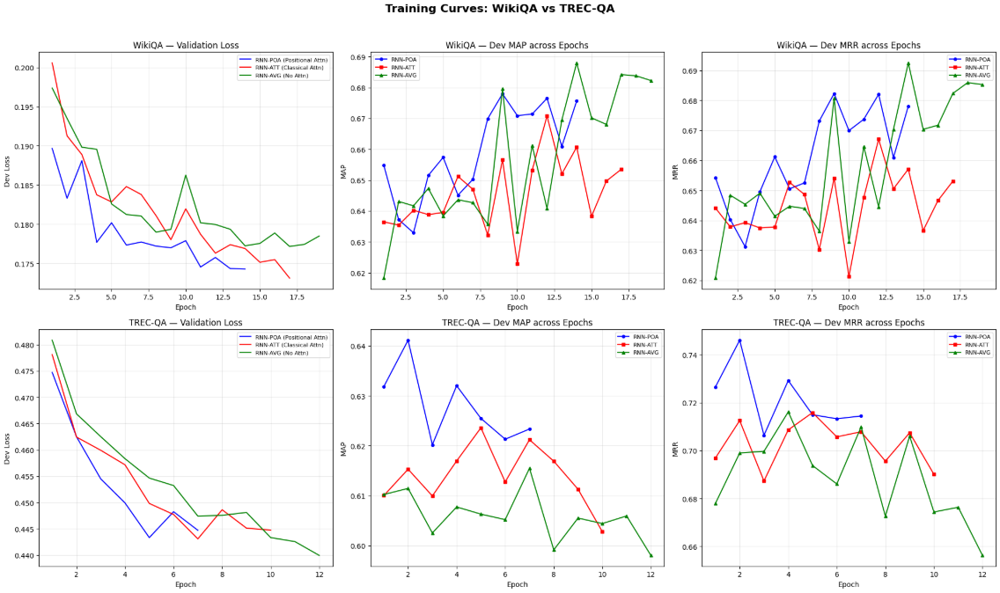
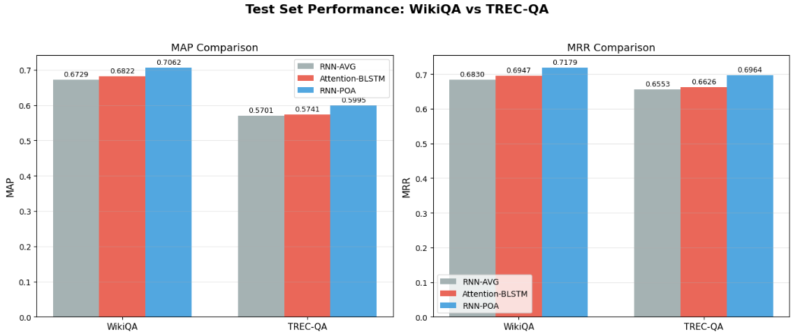
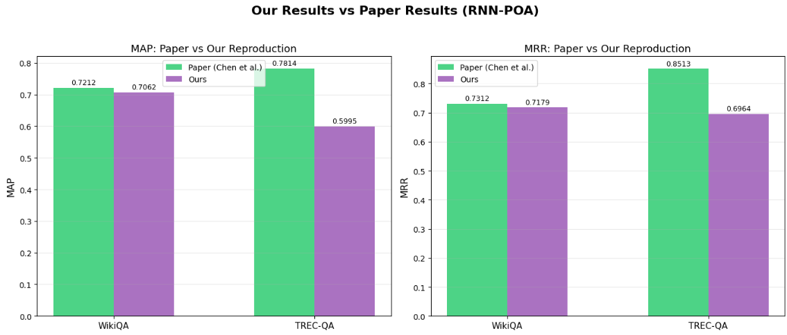
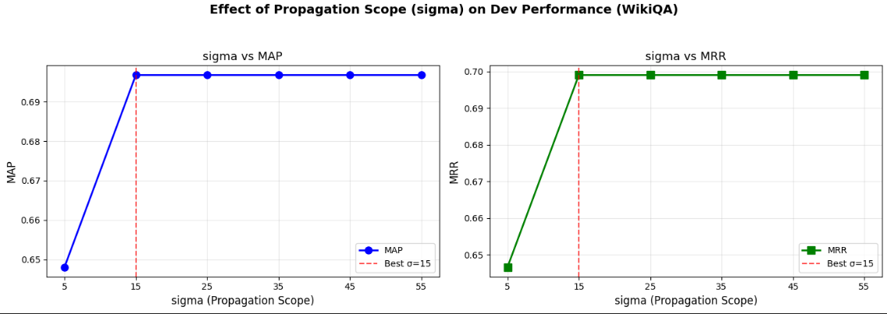
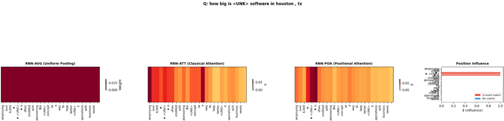
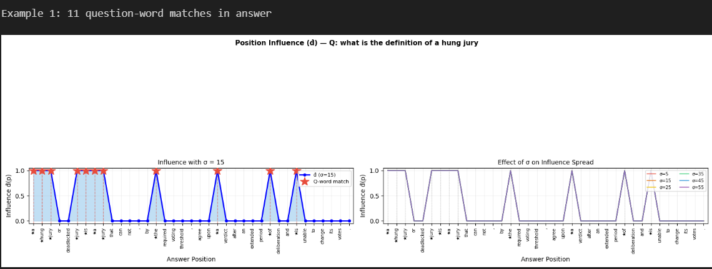

# Enhancing Recurrent Neural Networks with Positional Attention for Question Answering

> **Reproduction of:** Chen et al., SIGIR 2017 [[Paper]](https://doi.org/10.1145/3077136.3080699)  
> This repository contains the implementation of the research paper on *Enhancing RNN with Positional Attention for Q&A*.

---

## Overview

Standard attention mechanisms in RNN-based QA models rely purely on hidden representations, ignoring where question words appear in the answer. This paper proposes **positional attention**—if question words are close to similar answer tokens, they should contribute more to the answer's encoding.

**Key contributions reproduced:**
- Shared Bidirectional LSTM (BLSTM) encoder for questions and answers
- Gaussian-kernel position-aware influence propagation
- Positional attention mechanism over answer hidden states
- Manhattan distance similarity with L1 norm

---

## Repository Structure

```
.
├── Group7.ipynb      # Main step-by-step reproduction notebook
├── Enhancing Recurrent Neural Networks with Positional Attention for Question Answering.pdf   # Original paper
├── images/
│     ├── training_curves.png
│     ├── position_influence_example_N.png
│     ├── attention_heatmap_example_N.png
│     ├── dataset_comparison.png
│     ├── paper_vs_ours.png
│     └── sigma_tuning.png
└── README.md
```

---

## How to Use

### Requirements
`!pip install -q datasets nltk matplotlib tqdm`

GloVe embeddings (100d) are downloaded automatically from Stanford NLP on first run.

### Datasets

Datasets are loaded via HuggingFace `datasets`:
```python
from datasets import load_dataset
wiki_qa     = load_dataset('wiki_qa')
trec_qa_raw = load_dataset('lucadiliello/trecqa')
```

---

## Main Pipelines

The primary workflow for reproduction is in `Group7.ipynb` ([view here](https://github.com/p-priyanshu04/Deep-Learning-Project/blob/main/rnn_poa_reproduction.ipynb)).  
---

## Model Architecture

```
Question ──► BLSTM ──► Classical Attention ──► r_q ──┐
                                                    ├─► exp(-||r_q - r_a||₁) ──► similarity
Answer   ──► BLSTM ──► Positional Attention ──► r_a ┘
                         ▲
          Gaussian Kernel Influence (d̂)
          computed from question-word positions
```

| Model    | Question Repr.     | Answer Repr.        | Position-aware |
|----------|--------------------|---------------------|---------------|
| RNN-AVG  | mean pool          | mean pool           | ✗             |
| RNN-ATT  | mean pool          | classical attention | ✗             |
| RNN-POA  | classical attention| positional attention| ✓             |

---

## Results

### WikiQA

| Model         | MAP    | MRR    |
|---------------|--------|--------|
| RNN-AVG       | 0.6889 | 0.6999 |
| RNN-ATT       | 0.6961 | 0.7085 |
| RNN-POA (paper) | **0.7212** | **0.7312** |
| RNN-POA (ours) | **0.7062**  | **0.7179**   |

### TREC-QA (Clean)

| Model             | MAP    | MRR    |
|-------------------|--------|--------|
| RNN-AVG           | 0.7064 | 0.8086 |
| RNN-ATT           | 0.7180 | 0.8121 |
| RNN-POA (paper)   | **0.7814** | **0.8513** |
| RNN-POA (ours)    | 0.5862     | 0.6890 |

---

## Visualizations

The pipeline generates:
- `training_curves.png` — Training/dev loss, MAP, MRR per epoch

- `dataset_comparison.png` — Bar chart comparing MAP/MRR across WikiQA and TREC-QA

- `paper_vs_ours.png` — Results comparison with reported paper values

- `sigma_tuning.png` — Effect of σ on dev MAP/MRR

- `attention_heatmap_example_N.png` — Illustrates difference between classical and positional attention

- `position_influence_example_N.png` — Visualization of Gaussian kernel position influence


---

## Reference

- Original research article: [`Enhancing Recurrent Neural Networks with Positional Attention for Question Answering`](Enhancing%20Recurrent%20Neural%20Networks%20with%20Positional%20Attention%20for%20Question%20Answering.pdf)
- Notebook reproduction: [`Group7.ipynb`](Group7.ipynb)

---

## Contributions

- Kotikala Yashwant — Data Preprocessing
- Priyanshu Paliwal — Model Implementation and Working Example
- Oindrila Mandal — Baseline Model and Evaluation Metrics Implementation
- Riddhi Maiti — Training and Evaluation of Models and Hyperparameter Tuning
- Prerona Majhi — Results and Visualizations

---

## Citation

```bibtex
@inproceedings{chen2017enhancing,
  title     = {Enhancing Recurrent Neural Networks with Positional Attention for Question Answering},
  author    = {Chen, Qin and Hu, Qinmin and Huang, Jimmy Xiangji and He, Liang and An, Weijie},
  booktitle = {Proceedings of the 40th International ACM SIGIR Conference on Research and Development in Information Retrieval},
  pages     = {993--996},
  year      = {2017}
}
```
